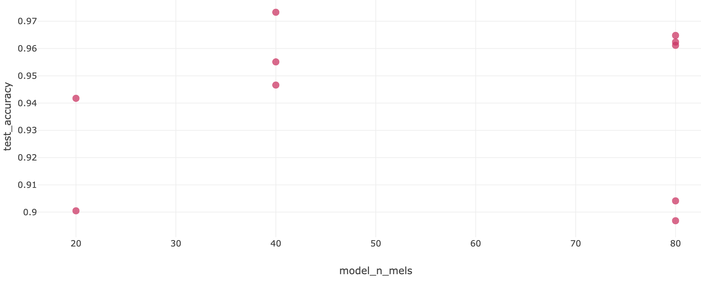
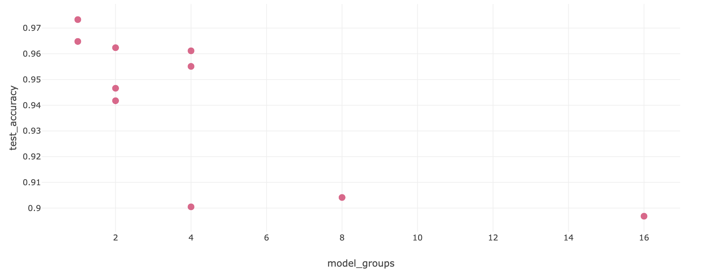
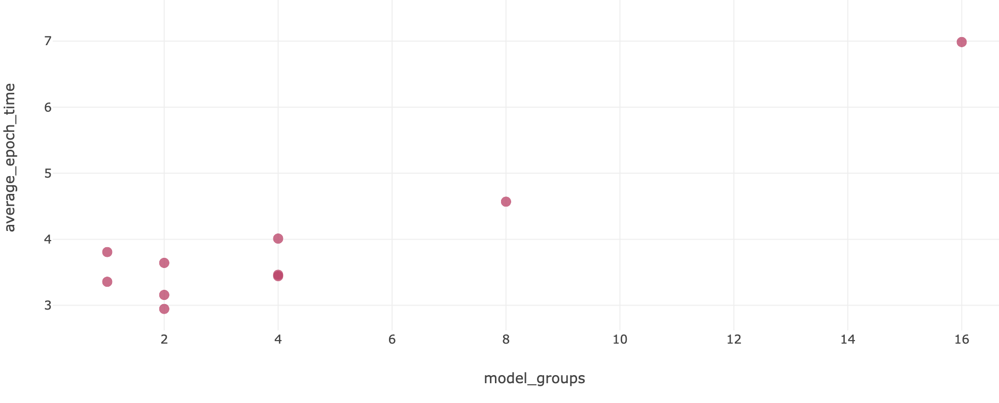
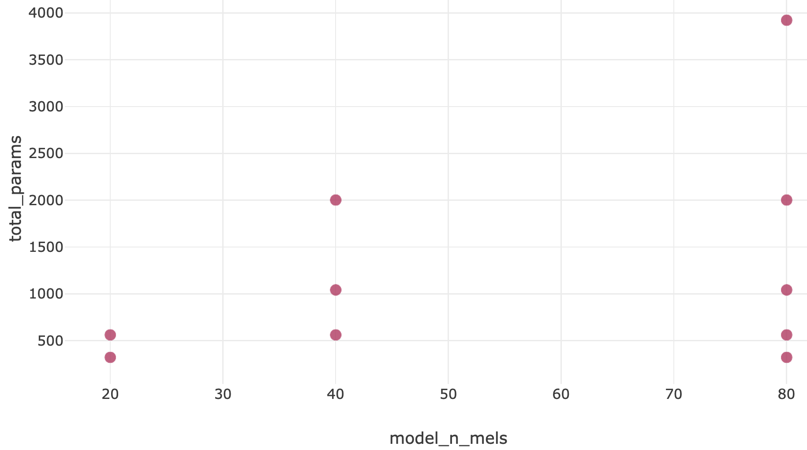
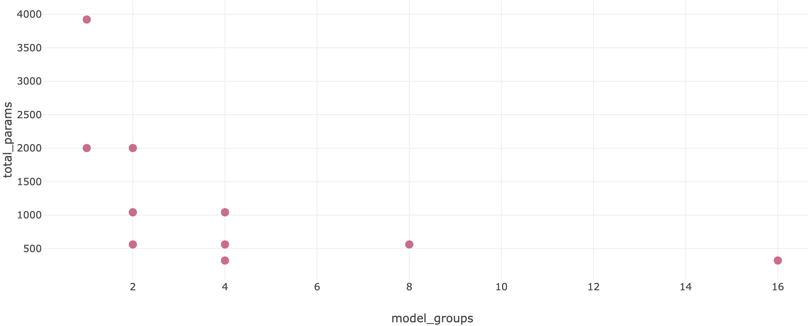
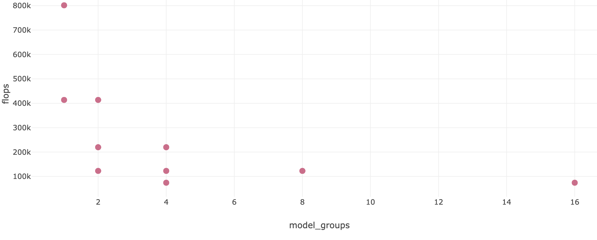

# CNN model on SPEECHCOMMANDS dataset

Model architecture can be looked up in the [model.ipynb](model.ipynb).

# Experiments Results
## `n_mels` <-> accuracy (on test data)

## `groups` (Conv1d param) <-> accuracy (on test data)

## epoch training time <-> `groups` (Conv1d param)

## `n_mels` <-> number of model parameters

## `groups` (Conv1d param) <-> number of model parameters

## `groups` (Conv1d param) <-> FLOPs

## Conclusions

1. Number of `groups` in `Conv1d` significantly affects accuracy, training time, and the number of model params.
Depending on the task model_groups can be increased (4 seems to be optimal in general case).
2. An optimal value of `n_mels` appears to be `40` in terms of model performance.